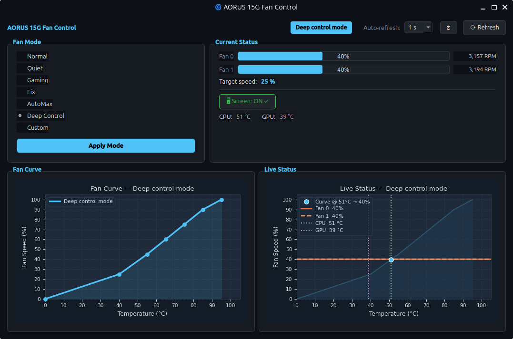

# Overview
This project adds a GUI for fan control on the [Gigabyte AORUS 15G XC](https://www.gigabyte.com/Laptop/AORUS-15G--RTX-30-Series) and similar AORUS models, built on top of [rcassani/p37-ec-aorus15g](https://github.com/rcassani/p37-ec-aorus15g).

This project is based on:

1. [rcassani/p37-ec-aorus15g](https://github.com/rcassani/p37-ec-aorus15g) — CLI fan control for the AORUS 15G KB (Intel Core i7-10875H + RTX 3070).
2. [p37-ec](https://github.com/jertel/p37-ec) — the original EC control tool written for older Gigabyte models (P37Xv5 and P37Wv5).
3. Two forks modified for the Gigabyte [Aero 14](https://github.com/christiansteinert/p37-ec-aero-14) and [Aero 15](https://github.com/tangalbert919/p37-ec-aero-15).

The project includes:

- **C program + Bash wrapper** — reads, monitors, and controls the Embedded Controller (EC) to configure fan modes and toggle the screen.
- **Custom DKMS kernel module (`ec_io`)** — exposes `/dev/ec_io` as a misc device, enabling EC access even with **Secure Boot enabled** (the standard `ec_sys` debugfs approach is blocked by kernel lockdown).
- **PySide6 GUI** — desktop application for graphical fan mode selection, live fan speed and temperature monitoring, and a fan curve chart — no terminal required.
- **PyInstaller packaging** — self-contained bundle installable system-wide with a `.desktop` entry and a polkit action for password-prompted elevation.

> **Tested on:** The CLI tools were originally developed for the AORUS 15G KB. The GUI application and all recent packaging changes were tested on a **Gigabyte AORUS 15G XC** running **Ubuntu 26.04**, with Secure Boot enabled.

---

# ⚠ Be careful

*This project comes without any warranty.*

If you have a different laptop model, first double-check the correct EC register values by observing what the Windows fan control program writes into the EC registers — use [`RWEverything`](http://rweverything.com/) on Windows to monitor EC register changes.

**Writing values into the wrong registers may damage your laptop!**

---

# Getting started

There are two ways to use this project — pick the one that fits your use case:

| | **GUI** | **CLI** |
|---|---|---|
| Interface | Desktop app, no terminal needed | Terminal commands |
| Use case | Day-to-day fan mode switching | Scripting, automation, low-level access |
| Requires | System deps + DKMS module + build + install | System deps + DKMS module + build C binary |

Both require the shared prerequisites below.

---

## Shared prerequisites

### 1. System dependencies

```bash
sudo apt-get install -y g++ dkms linux-source-$(uname -r | grep -oP '^\d+\.\d+\.\d+')
```

### 2. Install the kernel module (`ec_io`)

Both the GUI and CLI access the EC through a custom DKMS kernel module that creates `/dev/ec_io`. This works with **Secure Boot enabled** — the standard `ec_sys` debugfs approach is blocked by kernel lockdown when Secure Boot is active (see [Secure Boot note](#secure-boot-and-kernel-lockdown)).

```bash
sudo bash dkms/install.sh
```

This builds and installs the `ec_io` DKMS module, signs it with a managed MOK key, and prompts you to enroll that key if not already trusted.

If MOK enrollment is needed, reboot and complete it at the blue MOK manager screen:  
**Enroll MOK → Continue → Yes → enter the password you set → Reboot**

### 3. Auto-load the module on boot

```bash
echo "ec_io" | sudo tee /etc/modules-load.d/ec_io.conf
```

---

# GUI



A PySide6 desktop application for fan mode selection, live fan speed and temperature monitoring, and a fan curve chart. No terminal required after installation.

For full details on the GUI features and development usage, see [gui/README.md](./gui/README.md).

## Installation

**Build** (requires `curl` and `python3`; `uv` is installed automatically if missing):

```bash
bash packaging/build.sh
```

This produces a self-contained bundle at `dist/aorus-fan-control/` (~200 MB) that does not require Python or any pip packages on the target machine.

**Install system-wide:**

```bash
sudo bash packaging/install.sh
```

This copies the bundle to `/opt/aorus-fan-control/`, adds *AORUS Fan Control* to the system application menu, and installs a polkit action so a graphical password dialog appears on launch instead of requiring a terminal `sudo`.

## Running

After installation, find **AORUS Fan Control** in your app menu and double-click it — no terminal needed.

To run from the repo during development:

```bash
sudo python3 gui/main.py
```

---

# CLI

The original C program and Bash wrapper for direct EC register access from the terminal.

## Build

```bash
g++ p37ec-aorus15g.c -o p37ec-aorus15g -lm
```

The `-lm` flag is required for `round()` from `<math.h>`. The binary must be named `p37ec-aorus15g` — `set-fan-mode.sh` calls it by that exact name.

## Usage

All invocations require `sudo` (EC access via `/dev/ec_io` requires root):

```bash
# Read all current EC values and enable EC fan control
sudo ./p37ec-aorus15g

# Write a full 8-bit register value
sudo ./p37ec-aorus15g 0xB0 0xE5

# Write a single bit within a register (offset.bit notation, bit 0 = LSB)
sudo ./p37ec-aorus15g 0x08.6 1

# Set a named fan mode
sudo ./set-fan-mode.sh normal|quiet|gaming|deepcontrol|fix|automax [fan-speed%]
# fan-speed% (30–100) is required for "fix" and "automax" modes
```

Sample output of `sudo ./p37ec-aorus15g`:

```
  Usage: sudo ./p37ec-aorus15g [<hex-offset[.bit]> <hex-value>|<bit-value>]
     Ex: sudo ./p37ec-aorus15g 0xB0 0xE5
     Ex: sudo ./p37ec-aorus15g 0x08.6 1

  -----------------------------------
  Current Embedded Controller Values:
    Touchpad and screen
      Touchpad (1 = Enabled)    [0x03.5]: 1
      Screen   (0 = Enabled)    [0x09.3]: 0
    Fan status
      Fan current mode:                   Normal mode
      Fan0 speed (%)            [0xB3]:   31%
      Fan1 speed (%)            [0xB4]:   31%
      Fan0 speed (RPM)          [0xFC]:   2875 RPM
      Fan1 speed (RPM)          [0xFE]:   2913 RPM
    Fan control
      Fan Quiet mode bit        [0x08.6]: 0
      Fan Gaming mode bit       [0x0C.4]: 0
      Fan Deep control mode bit [0x0D.7]: 0
      Fan Auto Max bit          [0x0D.0]: 0
      Fan Fix mode bit          [0x06.4]: 0
      Fan0 target speed (%)     [0xB0]:   84%
      Fan1 target speed (%)     [0xB1]:   84%
  -----------------------------------
```

The notation `[0xB0]` represents an **8-bit** register within the EC.  
The notation `[0x08.6]` means bit `6` (bit 0 = LSB) of register `0x08`.

---

# Fan modes

There are **six** fan modes available in the [AORUS Control Center](https://download.gigabyte.com/FileList/Manual/ControlCenter_QSG_Manual_v1.1.pdf). Three are hard-coded: **Normal**, **Quiet**, and **Gaming**. Three are user-configurable: **AutoMax**, **Fix**, and **Deep control**. All modes are controlled by combinations of five EC bits:

| Fan mode \ Bit |`0x08.6`|`0x06.4`|`0x0D.0`|`0x0D.7`|`0x0C.4`|
|---|:---:|:---:|:---:|:---:|:---:|
| **Normal**       | 0 | 0 | 0 | 0 | 0 |
| **Quiet**        | 1 | X | X | X | X |
| **Fix** \*       | 0 | 1 | X | X | X |
| **AutoMax** ^    | 0 | 0 | 1 | X | X |
| **Deep control** | 0 | 0 | 0 | 1 | X |
| **Gaming**       | 0 | 0 | 0 | 0 | 1 |

\* **Fix** — write the desired fan speed % to `0xB0` (Fan0) and `0xB1` (Fan1) before setting this bit.  
^ **AutoMax** — write the *maximum* fan speed % to `0xB0` / `0xB1` before setting this bit.  
Fan speed encoding: 100% = 229 decimal = `0xE5` hex. Formula: `speed_dec = speed% × 229 / 100`.

## Normal mode
Default mode — balances fan speed, noise, and performance.
<p align="center">
<br>
<b>Normal mode</b>: fan speed vs temperature curve.
</p>

## Quiet mode
Reduces fan speeds to minimise noise. CPU and GPU are throttled to limit heat output.
<p align="center">
<br>
<b>Quiet mode</b>: fan speed vs temperature curve.
</p>

## Gaming mode
Similar to Normal but prioritises performance — higher fan speeds, more noise. Use under intense CPU/GPU workloads.
<p align="center">
<br>
<b>Gaming mode</b>: fan speed vs temperature curve.
</p>

## AutoMax mode
User sets the **maximum** fan speed in `0xB0` / `0xB1`. The EC controls CPU/GPU speeds to keep fans below that ceiling.

## Fix mode
User sets the **fixed** fan speed in `0xB0` / `0xB1`. Fans run at exactly that speed regardless of temperature.

## Deep control mode
User draws a custom fan speed vs temperature curve in the [AORUS Control Center](https://download.gigabyte.com/FileList/Manual/ControlCenter_QSG_Manual_v1.1.pdf).
<p align="center">
<br>
<b>Deep control mode</b>: (default) fan speed vs temperature curve.
</p>

---

# Temperature monitoring

The GUI displays live CPU and GPU temperatures alongside the fan curve chart.

**CPU temperature** is read (in priority order) from:
1. The `x86_pkg_temp` thermal zone (`/sys/class/thermal/thermal_zone*`) — the CPU package sensor
2. The `coretemp` hwmon entry labelled `Package id 0`
3. `sensors` stdout

> `acpitz` is excluded — it reports ambient/board temperature (~27 °C) regardless of load.

**GPU temperature** is read via:
```
nvidia-smi --query-gpu=temperature.gpu --format=csv,noheader,nounits
```
GPU temperature is displayed for information only and does not affect fan mode behaviour.

---

# Secure Boot and kernel lockdown

When Secure Boot is enabled the Linux kernel activates lockdown at the `integrity` level. This blocks EC access through the standard `ec_sys` debugfs interface in two independent ways:

1. **`LOCKDOWN_MODULE_PARAMETERS`** — prevents setting `module_param_hw` parameters (like `write_support=1`) at modprobe time.
2. **`LOCKDOWN_DEBUGFS`** — blocks `open()` on any debugfs file that has write permissions or is opened for writing (`fs/debugfs/file.c`), regardless of file ownership or process capabilities.

The `dkms/ec_io.c` module in this repo works around both restrictions by exposing a **misc device** (`/dev/ec_io`) instead of a debugfs file. Misc devices are not subject to `LOCKDOWN_DEBUGFS`. The module calls `ec_read()`/`ec_write()` — exported ACPI symbols from `<linux/acpi.h>` — directly.

The module is signed automatically by DKMS using a Machine Owner Key (MOK) enrolled in the Secure Boot trust chain, so the signed module loads without disabling Secure Boot.

---

# Related projects

- [opengigabyte](https://github.com/blmhemu/opengigabyte) — fixes brightness function keys on AORUS laptops
- [keyboard-fusion-rgb](https://github.com/rcassani/keyboard-fusion-rgb) — controls keyboard RGB LEDs

---

*This project is not affiliated with GIGA-BYTE Technology Co. Ltd.*
